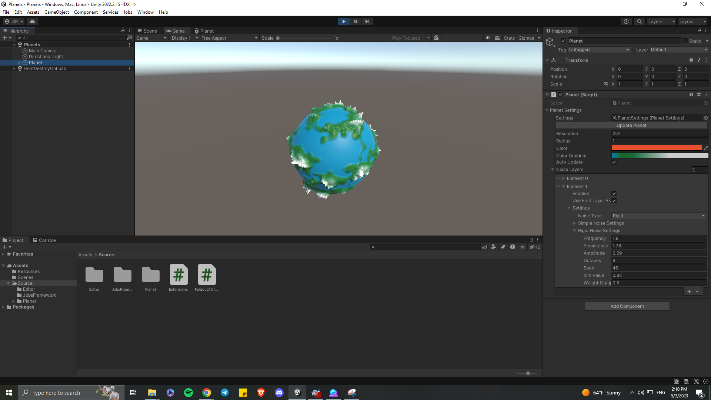

This project is inspired by Sebastian League Procedural Planets series.
It was a learning project and the goal was to implement procedural generation using Unity's JobsSystem for better perfomance, also using UI Elements for editor scripting.
The Unity version is 2022.2.15.

